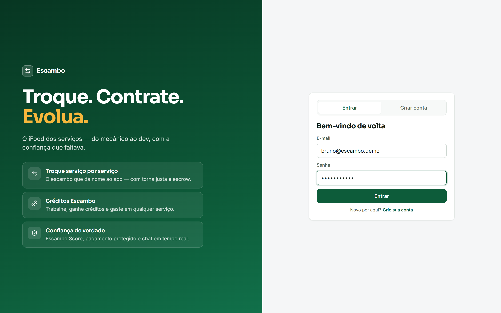
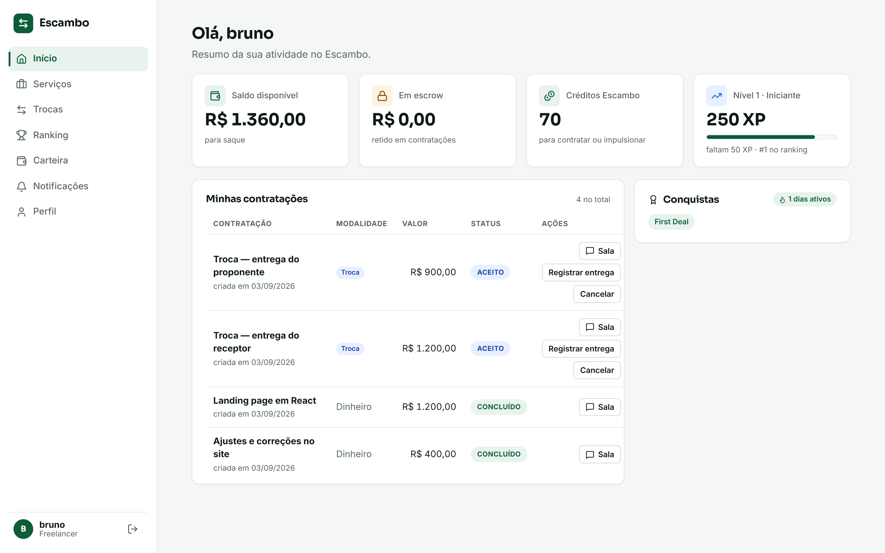
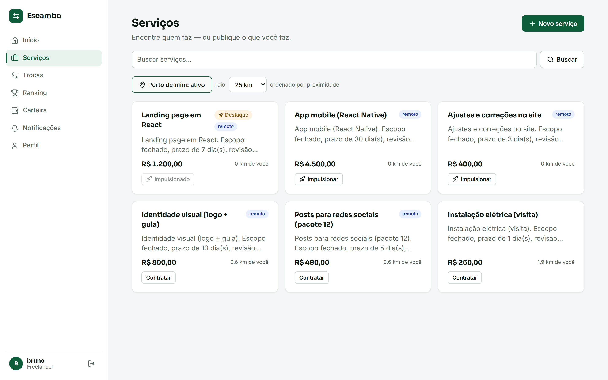
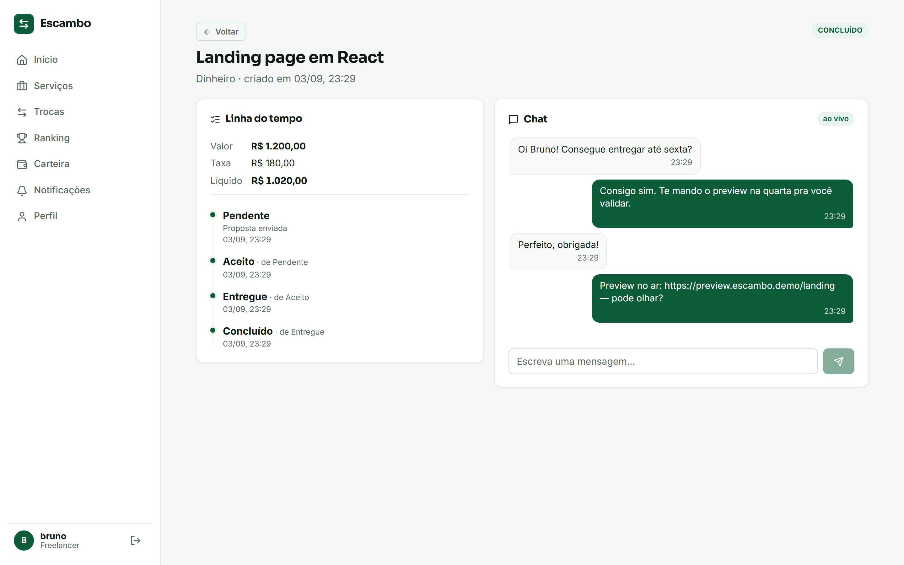
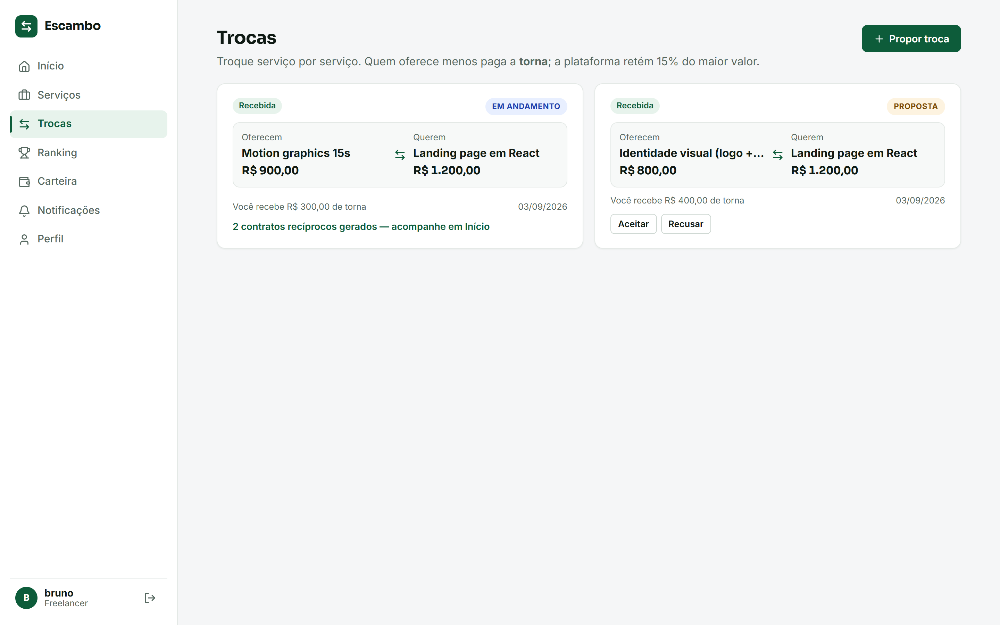
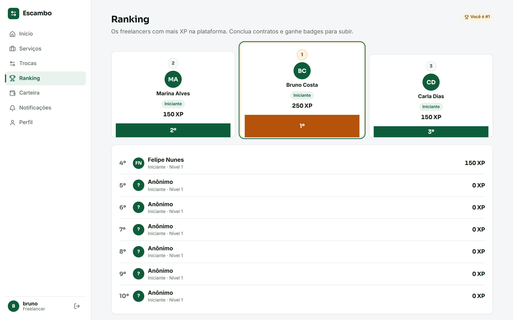
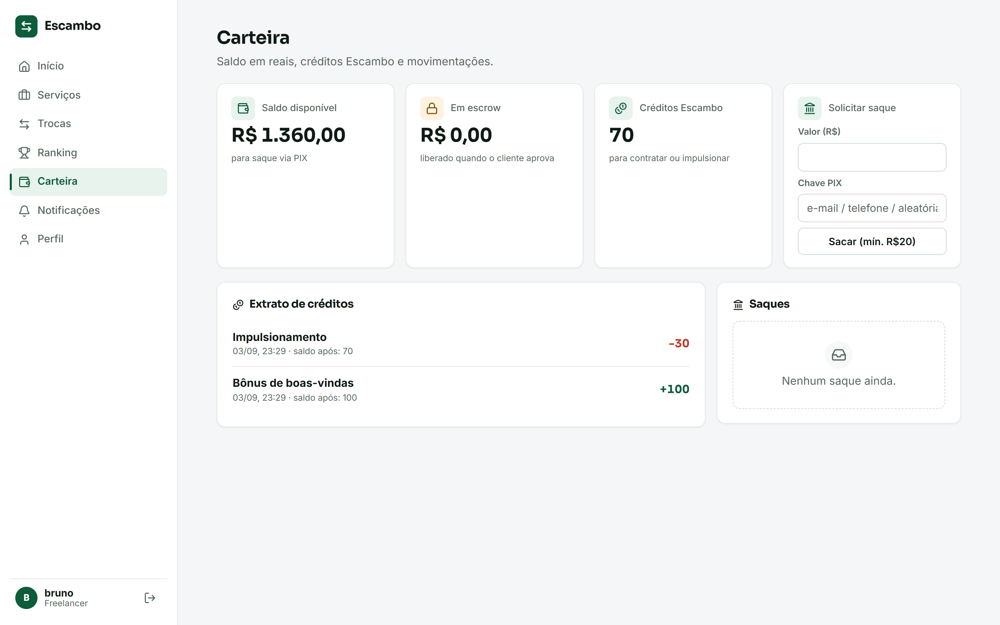
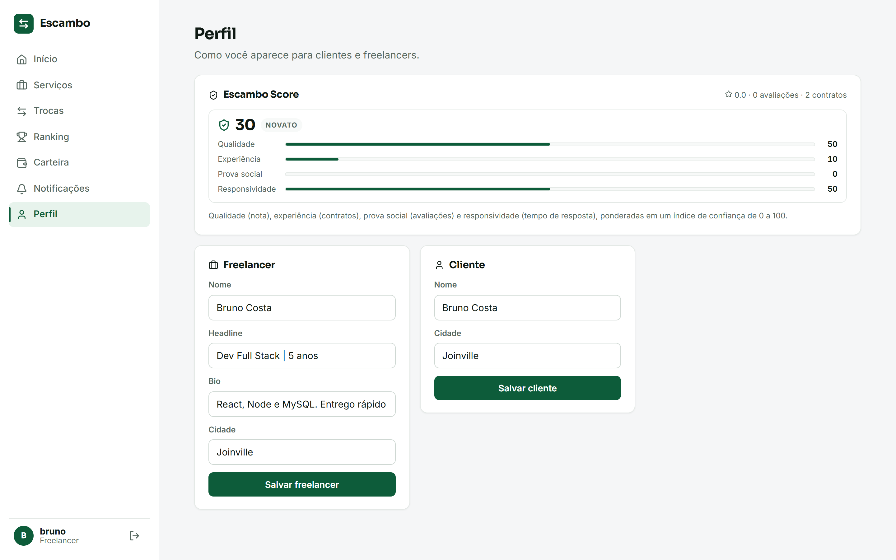

<div align="center">


<br />
<br />

```
███████╗███████╗ ██████╗ █████╗ ███╗   ███╗██████╗  ██████╗
██╔════╝██╔════╝██╔════╝██╔══██╗████╗ ████║██╔══██╗██╔═══██╗
█████╗  ███████╗██║     ███████║██╔████╔██║██████╔╝██║   ██║
██╔══╝  ╚════██║██║     ██╔══██║██║╚██╔╝██║██╔══██╗██║   ██║
███████╗███████║╚██████╗██║  ██║██║ ╚═╝ ██║██████╔╝╚██████╔╝
╚══════╝╚══════╝ ╚═════╝╚═╝  ╚═╝╚═╝     ╚═╝╚═════╝  ╚═════╝
```

### **Plataforma Digital de Serviços Freelance**
*O iFood dos serviços — conectando quem precisa com quem sabe fazer*

<br />

[🚀 Rodar em 2 minutos](#-rodar-em-2-minutos) · [🖼️ Telas](#️-telas) · [🎬 Roteiro de demo](#-roteiro-de-demo-2-minutos) · [✨ Diferenciais](#-diferenciais) · [🏗️ Arquitetura](#️-arquitetura) · [🧪 Qualidade](#-qualidade--testes) · [📄 Docs](#-documentação)

<br />

---

</div>

## 📌 Sobre o Projeto

O **Escambo** é um marketplace de serviços que conecta **clientes** a **freelancers** de qualquer nicho, do
eletricista ao desenvolvedor, com a simplicidade e a confiança que o iFood trouxe para o delivery. O que o
diferencia dos concorrentes: dá para **pagar um serviço com outro serviço** (o escambo que dá nome à plataforma),
usar **créditos de tempo** em vez de dinheiro, encontrar **quem está perto** e confiar num **índice de reputação
explicável**.

> **Contexto acadêmico:** projeto desenvolvido como Trabalho de Conclusão de Curso (TCC) na disciplina
> **PAC Extensionista VII**, da [Católica SC](https://www.catolicasc.org.br), com foco em extensão universitária
> e impacto social real. O Brasil tem mais de **24 milhões de trabalhadores autônomos** (IBGE) e ainda carece de
> uma plataforma que combine simplicidade, transparência e gestão num único produto.

---

## 🚀 Rodar em 2 minutos

Só precisa de **Docker**. Sobe MySQL 8, a API e o Web (nginx servindo o build), já com schema e migrations aplicados.

```bash
git clone https://github.com/Guirenzo/Escambo.git && cd Escambo
docker compose up -d --build          # db → migrations → api → web
docker compose run --rm demo-seed     # opcional: contas, serviços, contratações, chat, boost e trocas
```

Abra **http://localhost:8090** e entre com uma das contas da demo (senha de todas: `Escambo@123`):

| Conta | Papel | O que tem |
|---|---|---|
| `bruno@escambo.demo` | Freelancer | Contratações concluídas, chat, serviço impulsionado, trocas recebidas, saldo e créditos |
| `marina@escambo.demo` | Freelancer | Entrega aguardando aprovação e uma proposta de troca enviada |
| `cliente@escambo.demo` | Cliente | Contratações em todos os estados (pendente, em andamento, entregue, concluída) |

Outros freelancers da demo: `rafael`, `carla`, `diego`, `felipe` (`@escambo.demo`).

<details>
<summary><b>Comandos úteis da stack</b></summary>

```bash
docker compose ps                 # estado dos containers (healthchecks)
docker compose logs -f api web    # logs
docker compose down               # para (mantém os dados)
docker compose down -v            # para e apaga o banco (recarrega do zero na próxima subida)
```

Portas e segredos são configuráveis por variável de ambiente (`WEB_PORT`, `API_PORT`, `DB_PORT`, `JWT_SECRET`,
`DB_*`, `CORS_ORIGINS`), num `.env` na raiz ou no shell.

</details>

<details>
<summary><b>Modo desenvolvimento (hot reload)</b></summary>

Monorepo com **npm workspaces**: um `npm install` na raiz instala tudo.

```bash
npm install
npm run db:up        # só o MySQL no Docker (schema + seed automáticos)
npm run dev          # API (:3333) e Web (:5173) juntos, com reload
npm run demo:seed    # dados de demonstração na instância de dev
```

O front usa proxy `/api → :3333` (sem CORS em dev) e os tipos de `@escambo/types` são compartilhados entre
back e front. Copie `apps/api/.env.example` para `apps/api/.env` se quiser mudar algo (funciona sem).

</details>

---

## 🖼️ Telas

| | |
|---|---|
| **Login** — hero com os diferenciais<br /> | **Início** — saldo, escrow, créditos, nível e contratações<br /> |
| **Serviços** — busca, "perto de mim" e destaque<br /> | **Sala do contrato** — linha do tempo do escrow + chat ao vivo<br /> |
| **Trocas** — serviço por serviço, com torna<br /> | **Ranking** — pódio e XP<br /> |
| **Carteira** — R$, créditos, extrato e saques<br /> | **Perfil** — Escambo Score explicado<br /> |

<sub>Prints gerados automaticamente a partir dos dados de demonstração: `npm run -w apps/web screenshots`.</sub>

---

## 🎬 Roteiro de demo (2 minutos)

1. **Entrar** como `cliente@escambo.demo` → o dashboard mostra contratações em todos os estados do escrow.
2. **Serviços** → ligar **Perto de mim** (aceite a geolocalização): os cards ganham distância em km e os
   serviços impulsionados aparecem no topo com o selo **Destaque**.
3. **Contratar** "Landing page em React" → escolher **Créditos Escambo** ou **Dinheiro** (escrow com taxa de 15%)
   → **Enviar proposta** → cai na **Sala do contrato**.
4. Na sala, mandar uma mensagem no **chat**. Em outra aba, entrar como `bruno@escambo.demo`: a mensagem chega
   **ao vivo** (Socket.IO), e o freelancer pode **Aceitar → Entregar**; o cliente **Aprova** e o valor sai do
   escrow para a carteira.
5. Como Bruno: **Carteira** (saldo, créditos, extrato do bônus e do boost), **Perfil** (Escambo Score com os
   quatro fatores), **Ranking** (pódio por XP) e **Trocas** (aceitar a proposta gera dois contratos recíprocos).

---

## ✨ Diferenciais

| | Diferencial | Como funciona |
|---|---|---|
| 🔄 | **Troca de serviços (escambo)** | Um freelancer propõe trocar um serviço seu por um de outro. Ao aceitar, nascem **dois contratos recíprocos** com o mesmo fluxo de escrow; se os valores não batem, a diferença (**torna**) é paga em dinheiro, com 15% de taxa só sobre ela. |
| 🪙 | **Créditos Escambo (banco de tempo)** | Moeda interna sem taxa. Cada conta ganha um bônus de boas-vindas e pode **contratar em créditos** (retidos no aceite, liberados na aprovação) ou usá-los para **impulsionar** serviços. Ledger completo em `credit_transactions`, com efeitos atômicos junto às transições do contrato. |
| 📍 | **Descoberta local** | Perfis têm latitude/longitude; a busca aceita `lat`, `lng` e `radiusKm` e devolve a **distância** (Haversine no MySQL, filtrada em subquery). Serviços impulsionados vêm primeiro. |
| 🛡️ | **Escambo Score** | Índice de confiança 0–100 que **explica seus fatores**: qualidade (nota média), experiência (contratos), prova social (avaliações) e responsividade (tempo de resposta). Aparece no perfil e nos cards. |
| 🚀 | **Impulsionamento** | Planos de destaque pagos em créditos, com validade; o serviço sobe para o topo da busca e ganha o selo. |
| 🎮 | **Gamificação** | XP por contrato concluído, níveis, badges e ranking. |
| 💬 | **Chat em tempo real** | Sala por contrato com histórico, autenticada pelo mesmo JWT do REST. |
| 🔒 | **Escrow** | Cada transição de estado é atômica: status + histórico + efeito na carteira (ou no ledger de créditos) na mesma transação. |

---

## 🏗️ Arquitetura

```
┌───────────────────────────┐        ┌──────────────────────────────┐        ┌──────────────┐
│  apps/web  (React + Vite) │  /api  │  apps/api  (Express + TS)    │  SQL   │   MySQL 8    │
│  TanStack Query · Router  │ ─────▶ │  routes → services → repos   │ ─────▶ │  50 tabelas  │
│  Socket.IO client · UI kit│  /ws   │  Zod · JWT · pino · Socket.IO│        │  migrations  │
└───────────────────────────┘        └──────────────────────────────┘        └──────────────┘
              ▲                                       ▲
              └──────────── packages/types (DTOs compartilhados) ─────────────┘
```

| Camada | Tecnologia |
|---|---|
| **Web** | React 18, Vite 6, TypeScript, react-router 6, TanStack Query 5, socket.io-client, Lucide |
| **API** | Node 22, Express, TypeScript, Zod (validação), mysql2 (pool + transações), JWT + bcrypt, pino, Socket.IO |
| **Banco** | MySQL 8 · `schema.sql` (baseline) + `db/migrations` aplicadas por um runner próprio com ledger `schema_migrations` |
| **Infra** | Docker Compose (db → job de migrations → api → web/nginx), imagens sem root com healthcheck, CI no GitHub Actions |

**Pronta para produção**: proxy reverso (`TRUST_PROXY`), CORS configurável (REST e WebSocket), limite de corpo, gzip,
`X-Request-Id` em cada resposta e log, redação de segredos no log, rate limit global e de login, encerramento
gracioso com drenagem de conexões, `GET /api/health` (readiness, checa o banco) e `GET /api/health/live` (liveness).
Todas as variáveis estão documentadas em [`apps/api/.env.example`](./apps/api/.env.example).

---

## 🧪 Qualidade & Testes

Pirâmide de testes + lint + type-check, tudo no CI a cada push (badge no topo). São **três jobs** que precisam
passar em todo PR:

| Camada | O quê | Onde | Comando |
|---|---|---|---|
| **Unidade (API)** | Regras de negócio de cada serviço com as *repositories* mockadas — 109 testes em 22 arquivos | `apps/api/src/**/*.test.ts` | `npm test` |
| **Integração (API)** | App Express **real** via Supertest contra um MySQL de verdade (`escambo_test` recriado a cada run): escrow, créditos, geo, boosts, chat, hardening e migrations — 25 testes | `apps/api/test/integration/**` | `npm run -w @escambo/api test:int` |
| **Componente (Web)** | Client HTTP, helpers e views React (Testing Library + jsdom) — 17 testes | `apps/web/src/**/*.test.tsx` | `npm test` |
| **Ponta a ponta (Web + API + MySQL)** | Playwright: login, contratar → sala → chat, navegação, em **desktop e mobile** (Pixel 7), mais auditoria de **acessibilidade** com axe (WCAG 2.1 AA) | `apps/web/e2e/**` | `npm run -w apps/web e2e` |

```bash
npm test                          # unidade (API) + componente (Web) — sem banco
npm run -w @escambo/api test:int  # integração (precisa do MySQL: npm run db:up)
npm run -w apps/web e2e           # e2e: app no ar (npm run dev, ou E2E_BASE_URL=http://localhost:8090) e API com LOGIN_RATE_LIMIT_MAX=1000
```

---

## 📁 Estrutura do Repositório

```
escambo/
├── apps/
│   ├── api/                    # Node + Express + TS (rotas → serviços → repositórios)
│   │   ├── db/                 # schema.sql (baseline), seed.sql, migrations/
│   │   ├── src/modules/        # auth, profiles, services, contracts, credits, boosts, score,
│   │   │                       # barter, messaging, wallet, gamification, notifications, health…
│   │   ├── test/integration/   # Supertest + MySQL real
│   │   └── Dockerfile
│   └── web/                    # React + Vite + TS
│       ├── src/{features,components,lib}
│       ├── e2e/                # Playwright (smoke, mobile, a11y, screenshots)
│       ├── nginx.conf          # SPA + proxy /api e /socket.io
│       └── Dockerfile
├── packages/types/             # @escambo/types — DTOs compartilhados back/front
├── scripts/demo-seed.mjs       # dados de demonstração via API (idempotente)
├── docs/                       # RFC, requisitos, modelagem, screenshots
├── docker-compose.yml          # db + migrate + api + web (+ demo-seed)
└── .github/workflows/ci.yml    # Lint·Typecheck·Test·Build · Integração · E2E
```

---

## 📄 Documentação

| Documento | Descrição |
|---|---|
| [📋 RFC Completa](./docs/RFC.md) | Request for Comments — proposta técnica completa |
| [✅ Requisitos Funcionais](./docs/requisitos-funcionais.md) | 90 RFs especificados |
| [🔒 Requisitos Não Funcionais](./docs/requisitos-nao-funcionais.md) | 42 RNFs especificados |
| [🗄️ Modelagem do Banco](./docs/modelagem-banco.md) | 50 tabelas MySQL |
| [⚖️ Regras de Negócio](./docs/regras-de-negocio.md) | 75 RNs especificadas |
| [🔌 API](./apps/api/README.md) | Módulos, endpoints e convenções do backend |
| [🗃️ Banco e migrations](./apps/api/db/README.md) | Baseline, seed e runner de migrations |

---

## 🤝 Contribuindo

Fluxo em PRs pequenos sobre `main`, com CI verde obrigatório:

```bash
git checkout -b feat/nome-da-feature      # ou fix/descricao-do-bug
git commit -m "feat: adiciona módulo X"    # Conventional Commits
# abra um Pull Request para revisão
```

Consulte o [CONTRIBUTING.md](./CONTRIBUTING.md) para diretrizes de revisão e padrões de código.

---

## 📜 Licença

Distribuído sob a licença **MIT**. Consulte o arquivo [LICENSE](./LICENSE) para mais informações.

Por ser um projeto voltado à comunidade, o repositório é e permanecerá **público e de acesso aberto**, em
conformidade com as diretrizes do PAC Extensionista VII.

---

## 👤 Autor

Desenvolvido por **Guilherme Renzo** como projeto de TCC — PAC Extensionista VII  
Curso de Engenharia de Software · Católica SC · 2026

<div align="center">

[](https://www.linkedin.com/in/guilherme-renzo-284779271/)
[](https://github.com/Guirenzo)

<br />

*"Tornar a contratação de serviços mais acessível, rápida e confiável — conectando freelancers e clientes com poucos toques, sem burocracia e com total transparência."*

</div>
