<div align="center">


<br />
<br />

```
███████╗███████╗ ██████╗ █████╗ ███╗   ███╗██████╗  ██████╗
██╔════╝██╔════╝██╔════╝██╔══██╗████╗ ████║██╔══██╗██╔═══██╗
█████╗  ███████╗██║     ███████║██╔████╔██║██████╔╝██║   ██║
██╔══╝  ╚════██║██║     ██╔══██║██║╚██╔╝██║██╔══██╗██║   ██║
███████╗███████║╚██████╗██║  ██║██║ ╚═╝ ██║██████╔╝╚██████╔╝
╚══════╝╚══════╝ ╚═════╝╚═╝  ╚═╝╚═╝     ╚═╝╚═════╝  ╚═════╝
```

### **Plataforma Digital de Serviços Freelance**

_O iFood dos serviços — conectando quem precisa com quem sabe fazer_

<br />

[🚀 Rodar em 2 minutos](#-rodar-em-2-minutos) · [🖼️ Telas](#️-telas) · [🎬 Roteiro de demo](#-roteiro-de-demo-2-minutos) · [✨ Diferenciais](#-diferenciais) · [🏗️ Arquitetura](#️-arquitetura) · [🧪 Qualidade](#-qualidade--testes) · [📄 Docs](#-documentação)

<br />

---

</div>

## 📌 Sobre o Projeto

O **Escambo** é um marketplace de serviços que conecta **clientes** a **freelancers** de qualquer nicho, do
eletricista ao desenvolvedor, com a simplicidade e a confiança que o iFood trouxe para o delivery. O que o
diferencia dos concorrentes: dá para **pagar um serviço com outro serviço** (o escambo que dá nome à plataforma),
usar **créditos de tempo** em vez de dinheiro, encontrar **quem está perto** e confiar num **índice de reputação
explicável**.

> **Contexto acadêmico:** projeto desenvolvido como Trabalho de Conclusão de Curso (TCC) na disciplina
> **PAC Extensionista VII**, da [Católica SC](https://www.catolicasc.org.br), com foco em extensão universitária
> e impacto social real. O Brasil tem mais de **24 milhões de trabalhadores autônomos** (IBGE) e ainda carece de
> uma plataforma que combine simplicidade, transparência e gestão num único produto.

---

## 🚀 Rodar em 2 minutos

Só precisa de **Docker**. Sobe MySQL 8, a API e o Web (nginx servindo o build), já com schema e migrations aplicados.

```bash
git clone https://github.com/Guirenzo/Escambo.git && cd Escambo
docker compose up -d --build          # db → migrations → api → web
docker compose run --rm demo-seed     # opcional: contas, serviços, contratações, chat, boost e trocas
```

Abra **http://localhost:8090** e entre com uma das contas da demo (senha de todas: `Escambo@123`):

| Conta                  | Papel      | O que tem                                                                               |
| ---------------------- | ---------- | --------------------------------------------------------------------------------------- |
| `bruno@escambo.demo`   | Freelancer | Contratações concluídas, chat, serviço impulsionado, trocas recebidas, saldo e créditos |
| `marina@escambo.demo`  | Freelancer | Entrega aguardando aprovação e uma proposta de troca enviada                            |
| `cliente@escambo.demo` | Cliente    | Contratações em todos os estados (pendente, em andamento, entregue, concluída)          |
| `admin@escambo.demo`   | Admin      | Painel de administração: métricas, fila de mediação (uma disputa aberta) e moderação    |

Outros freelancers da demo: `rafael`, `carla`, `diego`, `felipe` (`@escambo.demo`).

<details>
<summary><b>Comandos úteis da stack</b></summary>

```bash
docker compose ps                 # estado dos containers (healthchecks)
docker compose logs -f api web    # logs
docker compose down               # para (mantém os dados)
docker compose down -v            # para e apaga o banco (recarrega do zero na próxima subida)
```

Portas e segredos são configuráveis por variável de ambiente (`WEB_PORT`, `API_PORT`, `DB_PORT`, `JWT_SECRET`,
`DB_*`, `CORS_ORIGINS`), num `.env` na raiz ou no shell.

</details>

<details>
<summary><b>Produção numa VPS (imagens do CI + HTTPS automático)</b></summary>

A cada merge em `main` com CI verde, o job **Publicar imagens** constrói a API e o Web e publica em
`ghcr.io/guirenzo/escambo-api` e `ghcr.io/guirenzo/escambo-web` (tags `latest`, sha curto e versão).
A VPS só puxa: `docker-compose.prod.yml` sobe MySQL → migrations (+ seed do catálogo) → API → Web → **Caddy**
(Let's Encrypt, HTTP/3, HSTS), sem porta de banco/API no host, com segredos obrigatórios e o simulador de
pagamento desligado. Atualizar é `pull && up -d`; rollback é trocar `IMAGE_TAG`; `GET /api/health` diz a
versão e o commit no ar; `scripts/backup-db.sh` e `restore-db.sh` cuidam do banco, `backup-uploads.sh` dos anexos do chat. Passo a passo em
[**DEPLOY.md**](./DEPLOY.md).

</details>

<details>
<summary><b>Modo desenvolvimento (hot reload)</b></summary>

Monorepo com **npm workspaces**: um `npm install` na raiz instala tudo.

```bash
npm install
npm run db:up        # só o MySQL no Docker (schema + seed automáticos)
npm run dev          # API (:3333) e Web (:5173) juntos, com reload
npm run demo:seed    # dados de demonstração na instância de dev
```

O front usa proxy `/api → :3333` (sem CORS em dev) e os tipos de `@escambo/types` são compartilhados entre
back e front. Copie `apps/api/.env.example` para `apps/api/.env` se quiser mudar algo (funciona sem).

</details>

---

## 🖼️ Telas

|                                                                                                                                                                                                            |                                                                                                                                                                                            |
| ---------------------------------------------------------------------------------------------------------------------------------------------------------------------------------------------------------- | ------------------------------------------------------------------------------------------------------------------------------------------------------------------------------------------ |
| **Login** — hero com os diferenciais<br />                                                                                                          | **Início** — saldo, escrow, créditos, nível e contratações<br />                                                                  |
| **Serviços** — busca por texto e categoria, "perto de mim", favoritos e destaque<br />                                                        | **Sala do contrato** — linha do tempo do escrow, avaliação e chat ao vivo<br />                                  |
| **Trocas** — serviço por serviço, com torna<br />                                                                                                 | **Ranking** — pódio e XP<br />                                                                                                  |
| **Carteira** — R$, créditos, extrato e saques<br />                                                                                           | **Perfil** — Escambo Score explicado e avaliações recebidas<br />                                                                 |
| **Perfil público** — reputação, serviços e avaliações de quem presta<br />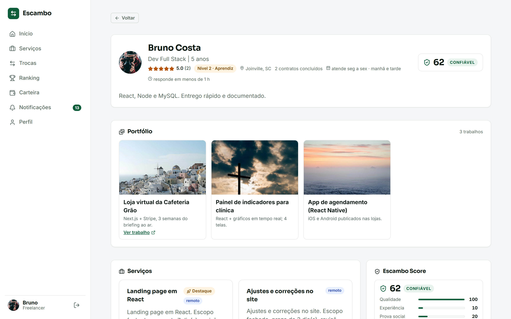                                                        | **Mobile** — mesma app, navegação no rodapé (Pixel 7)<br />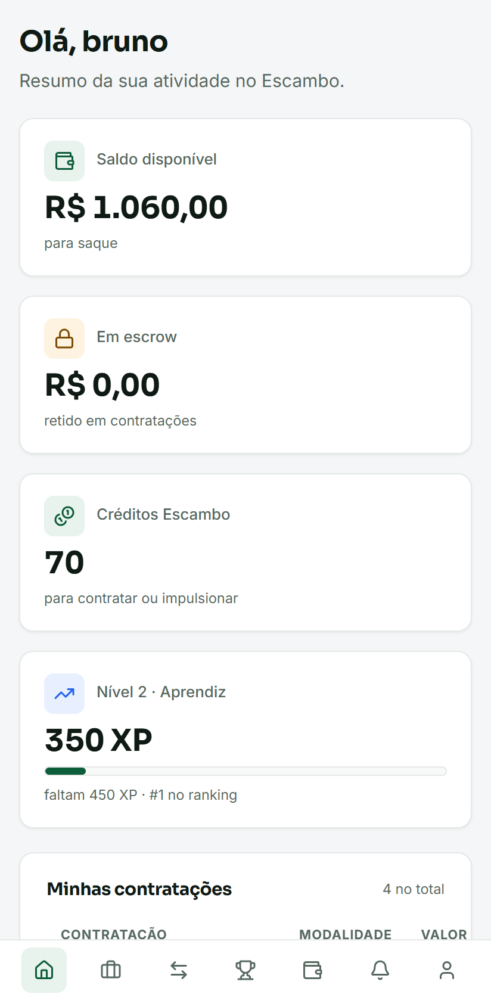                                                      |
| **Admin** — métricas, saúde da moderação, fila de mediação e decisão sobre o escrow<br />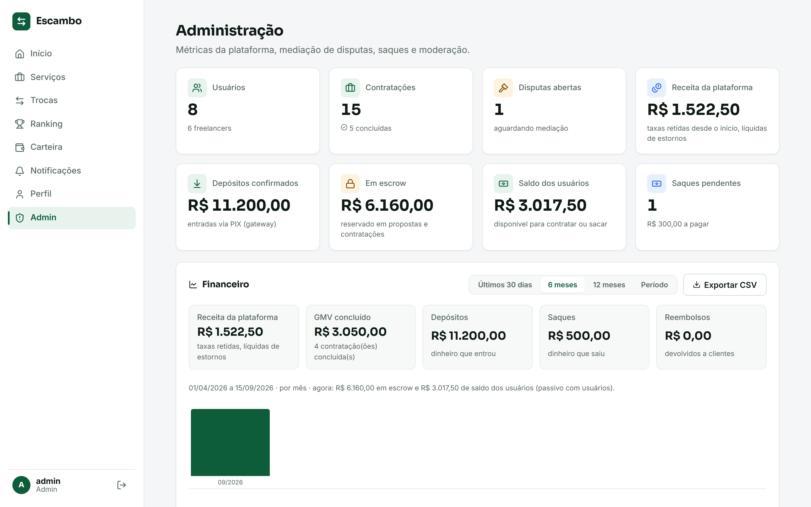                                                    | **Sala em disputa** — contrato congelado aguardando a mediação<br />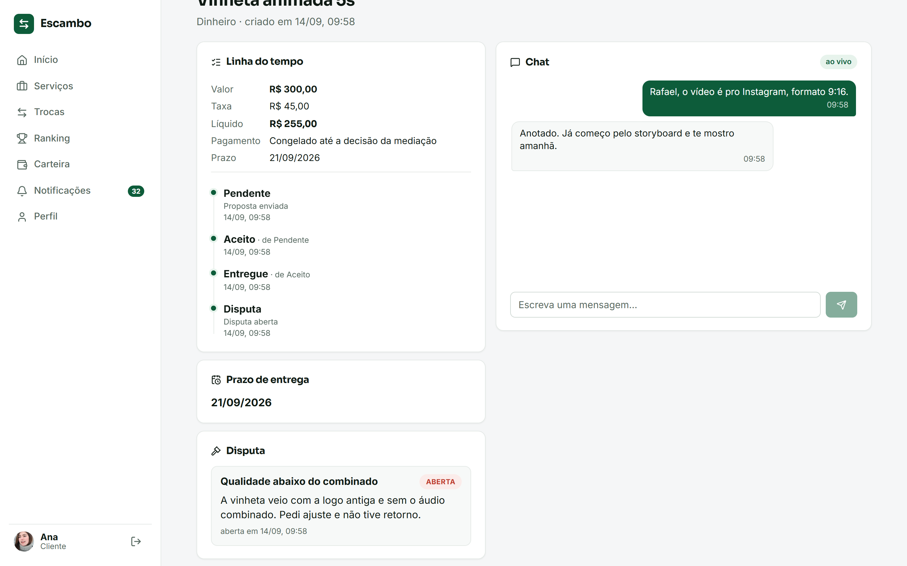                                   |
| **Depósito PIX** — cobrança com QR e copia e cola; na demo o gateway é simulado<br />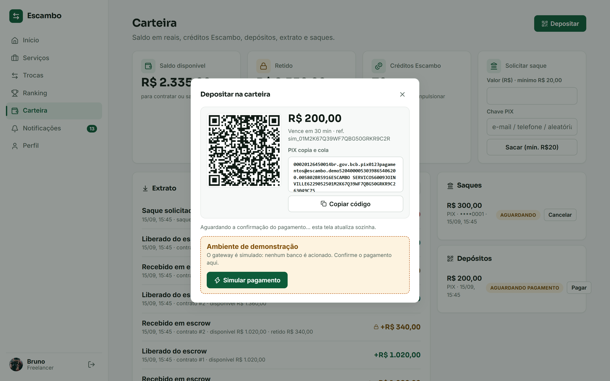                                             | **Contratar** — saldo da carteira pré-paga e valor reservado já na proposta<br />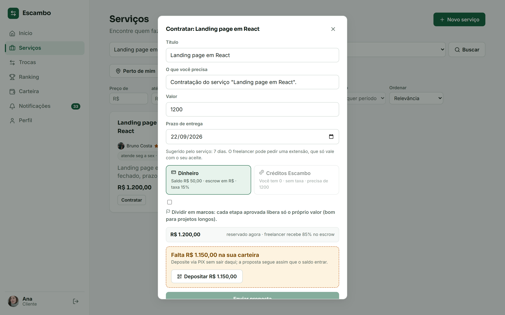                                |
| **Marcos** — escrow liberado etapa por etapa, com entrega e aprovação por marco<br />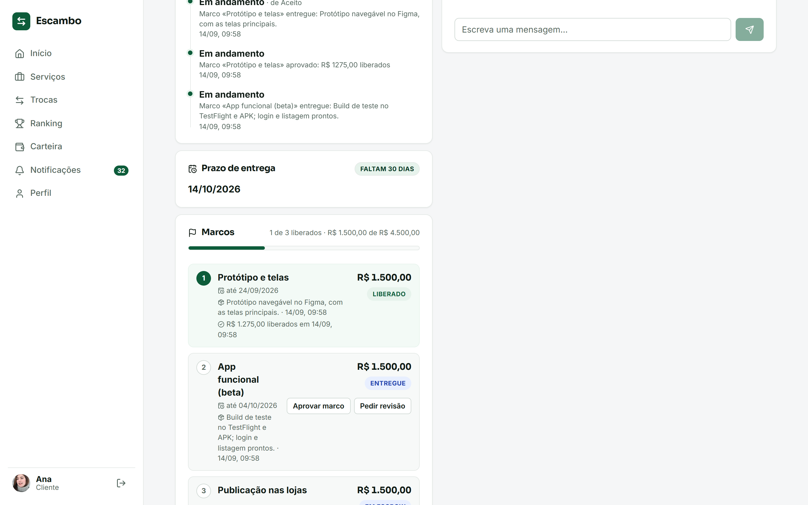                                        | **Caixa de saída de e-mails** — provedor simulado: confirmação, senha e avisos com os links<br />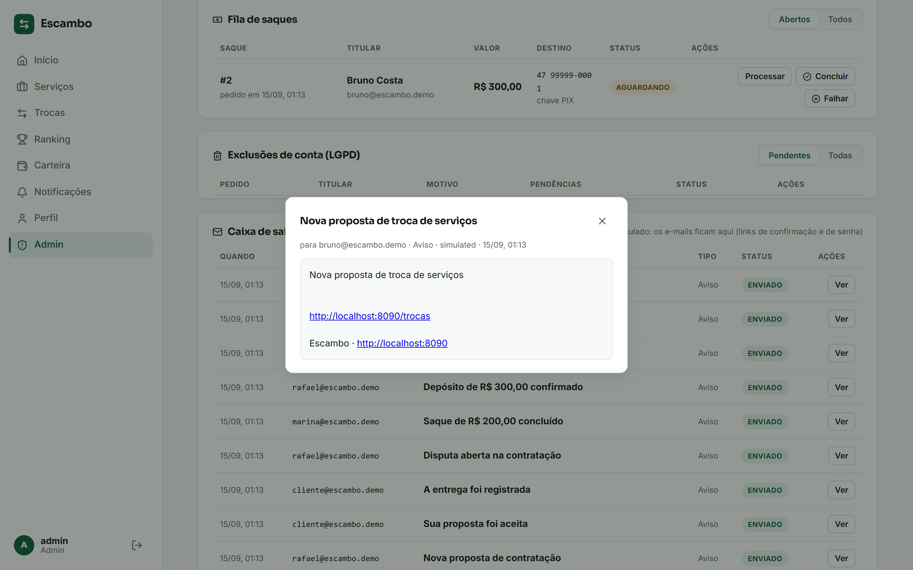     |
| **Prazo de entrega** — quanto falta, pedido de extensão do freelancer e decisão do cliente<br />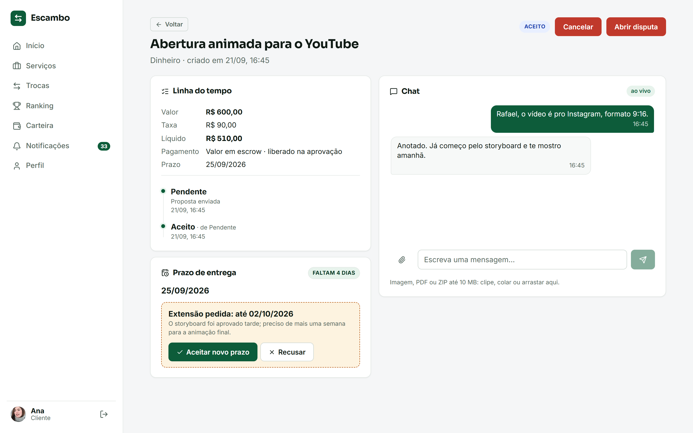          | **Avisos no navegador** — push por aparelho, com aviso de teste e o chat de fora<br />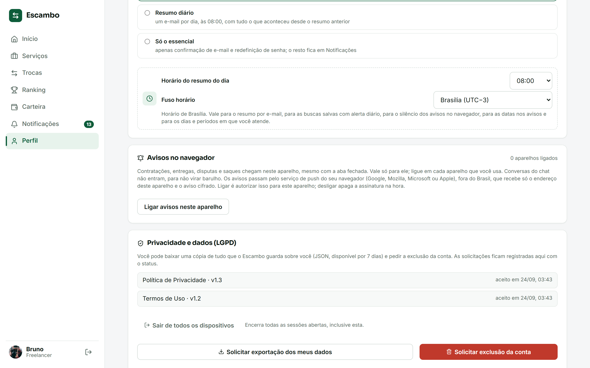 |
| **Portfólio pelo teclado** — o trabalho "na mão", a prévia da ordem e as setas fora de cena<br />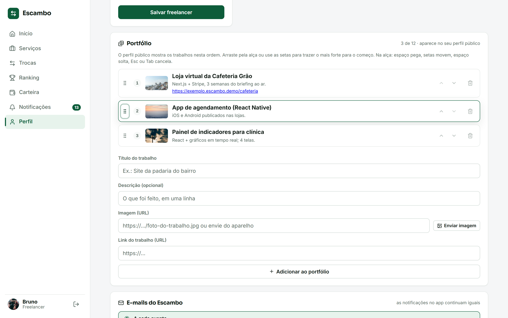 | **Não perturbe** — a janela de silêncio dos avisos no navegador, no fuso da conta<br />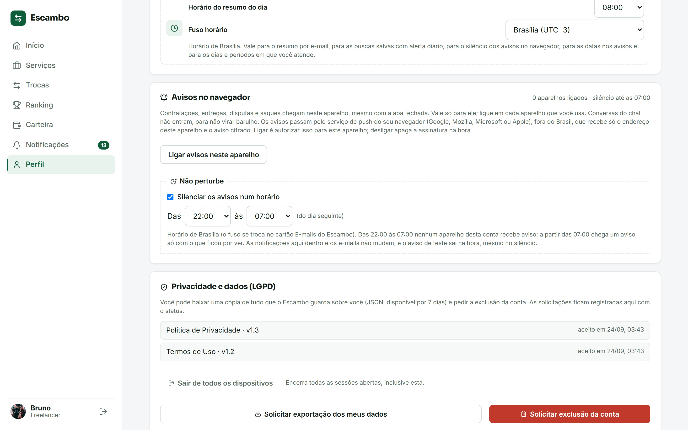 |

<sub>Prints gerados automaticamente a partir dos dados de demonstração: `npm run -w apps/web screenshots`.</sub>

---

## 🎬 Roteiro de demo (2 minutos)

1. **Entrar** como `cliente@escambo.demo` → o dashboard mostra contratações em todos os estados do escrow. **Carteira** → **Depositar**: gera uma cobrança PIX (QR + copia e cola) e, na demo, **Simular pagamento** confirma na hora — o saldo entra e o extrato registra.
2. **Serviços** → filtrar por categoria, favoritar com o coração (filtro "Só favoritos") e ligar **Perto de mim** (aceite a geolocalização): os cards ganham distância em km e os
   serviços impulsionados aparecem no topo com o selo **Destaque**.
3. Freelancer logado vê **Propor troca** em qualquer card de outro freelancer (abre Trocas com o serviço já escolhido). **Contratar** "Landing page em React" → escolher **Créditos Escambo** ou **Dinheiro** (o valor é **reservado** da carteira pré-paga na hora; sem saldo, o depósito acontece no próprio modal; taxa de 15% no aceite)
   → **Enviar proposta** → cai na **Sala do contrato**.
4. Na sala, mandar uma mensagem no **chat**. Em outra aba, entrar como `bruno@escambo.demo`: a mensagem chega
   **ao vivo** (Socket.IO), e o freelancer pode **Aceitar → Entregar**; o cliente **pede revisão** (a entrega volta com o motivo) ou **Aprova** (o valor sai do escrow para a carteira) e **Avalia** com estrelas e comentário; a nota entra na hora no Escambo Score do
   freelancer, que pode responder uma vez.
5. Como `admin@escambo.demo`: **Admin** → fila de mediação com a disputa da demo → **Resolver** (liberar, devolver ou dividir; o cliente recebe o reembolso de verdade); **Fila de saques** → **Concluir** (pago) ou **Falhar** (estorno para a carteira) — o titular é notificado.
6. Como Bruno: **Carteira** (saldo, retido, extrato em R$ e em créditos, saque na fila do admin), **Perfil** (Escambo Score com os
   quatro fatores), **Ranking** (pódio por XP) e **Trocas** (aceitar a proposta gera dois contratos recíprocos).

---

## ✨ Diferenciais

|     | Diferencial                           | Como funciona                                                                                                                                                                                                                                                                                                                                                                                                                                                                                                                                                                                                                                                                                                                                                                                                                                                                                                                                                                                                                                                                                                                                                                                                                                                                                                                                                                                                                                                                                                                                                                                                                                                                                                                                                                                                                                                                                                                                                                                                         |
| --- | ------------------------------------- | --------------------------------------------------------------------------------------------------------------------------------------------------------------------------------------------------------------------------------------------------------------------------------------------------------------------------------------------------------------------------------------------------------------------------------------------------------------------------------------------------------------------------------------------------------------------------------------------------------------------------------------------------------------------------------------------------------------------------------------------------------------------------------------------------------------------------------------------------------------------------------------------------------------------------------------------------------------------------------------------------------------------------------------------------------------------------------------------------------------------------------------------------------------------------------------------------------------------------------------------------------------------------------------------------------------------------------------------------------------------------------------------------------------------------------------------------------------------------------------------------------------------------------------------------------------------------------------------------------------------------------------------------------------------------------------------------------------------------------------------------------------------------------------------------------------------------------------------------------------------------------------------------------------------------------------------------------------------------------------------------------------------- |
| 🔄  | **Troca de serviços (escambo)**       | Um freelancer propõe trocar um serviço seu por um de outro. Ao aceitar, nascem **dois contratos recíprocos** com o mesmo fluxo de escrow. Quem recebe o serviço mais valioso paga a diferença (**torna**), **reservada da carteira** ao propor ou ao aceitar (sem saldo, deposita ali mesmo), retida enquanto os dois lados entregam e liberada ao outro lado, menos 15% de taxa só sobre ela, quando ambos aprovam; recusa, cancelamento ou disputa devolvem a reserva.                                                                                                                                                                                                                                                                                                                                                                                                                                                                                                                                                                                                                                                                                                                                                                                                                                                                                                                                                                                                                                                                                                                                                                                                                                                                                                                                                                                                                                                                                                                                              |
| 🪙  | **Créditos Escambo (banco de tempo)** | Moeda interna sem taxa. Cada conta ganha um bônus de boas-vindas e pode **contratar em créditos** (retidos no aceite, liberados na aprovação) ou usá-los para **impulsionar** serviços. Ledger completo em `credit_transactions`, com efeitos atômicos junto às transições do contrato.                                                                                                                                                                                                                                                                                                                                                                                                                                                                                                                                                                                                                                                                                                                                                                                                                                                                                                                                                                                                                                                                                                                                                                                                                                                                                                                                                                                                                                                                                                                                                                                                                                                                                                                               |
| 📍  | **Descoberta local**                  | Perfis têm latitude/longitude; a busca aceita `lat`, `lng` e `radiusKm` e devolve a **distância** (Haversine no MySQL, filtrada em subquery). Serviços impulsionados vêm primeiro.                                                                                                                                                                                                                                                                                                                                                                                                                                                                                                                                                                                                                                                                                                                                                                                                                                                                                                                                                                                                                                                                                                                                                                                                                                                                                                                                                                                                                                                                                                                                                                                                                                                                                                                                                                                                                                    |
| 🛡️  | **Escambo Score**                     | Índice de confiança 0–100 que **explica seus fatores**: qualidade (nota média), experiência (contratos), prova social (avaliações) e responsividade (tempo médio de resposta no chat, medido de verdade a cada resposta do freelancer a uma mensagem do cliente). Aparece no perfil e nos cards.                                                                                                                                                                                                                                                                                                                                                                                                                                                                                                                                                                                                                                                                                                                                                                                                                                                                                                                                                                                                                                                                                                                                                                                                                                                                                                                                                                                                                                                                                                                                                                                                                                                                                                                      |
| ⭐  | **Avaliações**                        | Só o cliente avalia, só contratação concluída, uma avaliação por contrato e até 7 dias após a aprovação. A nota média e a contagem são recalculadas na **mesma transação** e aparecem no perfil, nos cards de serviço e no Score; o freelancer responde uma vez, publicamente.                                                                                                                                                                                                                                                                                                                                                                                                                                                                                                                                                                                                                                                                                                                                                                                                                                                                                                                                                                                                                                                                                                                                                                                                                                                                                                                                                                                                                                                                                                                                                                                                                                                                                                                                        |
| ⚖️  | **Mediação, denúncia e LGPD**         | Qualquer parte pode **abrir disputa** numa contratação em andamento ou entregue; o contrato congela e um **admin** decide o escrow (liberar, devolver ou dividir) numa única transação, notificando as partes. Perfis, serviços, avaliações, mensagens, **fotos e imagens do portfólio** podem ser **denunciados**; o admin analisa a **fila de denúncias** agrupada por alvo e decide dispensar, resolver, **remover a imagem** ou **remover a avaliação ou a mensagem** (a nota média é recalculada e o chat mostra o aviso). Mensagem com **Pix, telefone, e-mail ou WhatsApp** avisa na hora, para as duas partes, que fora do Escambo não há proteção do escrow, e entra sozinha na fila como **sinalização automática**, que sai de todo perfil na hora, avisa o dono e **não pode ser enviada de novo**, nem reencodada ou reduzida; o dono **contesta pelo perfil** dentro do prazo e o admin mantém ou **reverte com a imagem de volta**, e remoções seguidas **bloqueiam o envio de imagens** por um tempo crescente até a conta ir para revisão. Contas podem ser moderadas (suspender/banir/reativar) com efeito imediato: sessões revogadas, token vigente negado, login bloqueado. O usuário aceita **Termos de Uso** e **Política de Privacidade** no cadastro (consentimento versionado); no Perfil **baixa uma cópia de tudo** que a plataforma guarda sobre ele (JSON gerado na hora, válido por 7 dias) e pede a **exclusão da conta**, que o admin conclui **anonimizando** e-mail, perfil e serviços (contratações e extratos ficam sem identificação) ou recusa com justificativa; contratações abertas e saldo impedem o pedido. Admins são definidos por `ADMIN_EMAILS` e ajustam no painel os **parâmetros da plataforma** (comissão, aprovação tácita, validade da proposta, carência do prazo, retenção dos anexos, prazo de contestação e reincidência, mínimos de saque e de serviço, trocas on/off e **modo de manutenção** com tela no app), com limites, auditoria e efeito imediato. |
| ⏱️  | **Aprovação tácita**                  | Entrega sem resposta do cliente por `tacit_approval_days` dias (configuração da plataforma, padrão 5) é aprovada por um job em background, com a mesma transação da aprovação manual; o cliente também pode **pedir revisão**, devolvendo a entrega ao freelancer com o motivo.                                                                                                                                                                                                                                                                                                                                                                                                                                                                                                                                                                                                                                                                                                                                                                                                                                                                                                                                                                                                                                                                                                                                                                                                                                                                                                                                                                                                                                                                                                                                                                                                                                                                                                                                       |
| 📅  | **Prazo com consequência**            | Toda contratação tem prazo (sugerido pelo serviço). Proposta sem resposta em `proposal_expiry_hours` **expira** e devolve a reserva; o freelancer pede **uma** extensão, que só vale com o aceite do cliente; prazo estourado avisa as duas partes e, `deadline_grace_hours` depois, a **mediação é aberta automaticamente** (RN-021, 028 e 029). Marcos têm prazo próprio opcional ("Distribuir prazos" no modal); marco atrasado avisa as duas partes.                                                                                                                                                                                                                                                                                                                                                                                                                                                                                                                                                                                                                                                                                                                                                                                                                                                                                                                                                                                                                                                                                                                                                                                                                                                                                                                                                                                                                                                                                                                                                              |
| 📊  | **Financeiro do admin**               | Receita da plataforma **derivada do ledger** de R$ (taxas retidas, líquidas de estornos), depósitos, saques, reembolsos e GMV por dia ou mês, com gráfico e **exportação do ledger em CSV** para contabilidade.                                                                                                                                                                                                                                                                                                                                                                                                                                                                                                                                                                                                                                                                                                                                                                                                                                                                                                                                                                                                                                                                                                                                                                                                                                                                                                                                                                                                                                                                                                                                                                                                                                                                                                                                                                                                       |
| 🔎  | **Busca com filtros**                 | Texto, categoria, **perto de mim** com raio, faixa de preço, prazo máximo, nota mínima do prestador, **dia e período em que atende** ("quem atende sábado à noite", só entre quem informou os dias; dia sem período vale o dia todo), **atende agora** (aceitando pedidos, no dia e período de agora **no fuso de cada freelancer**; o card mostra "atende seg a sex · manhã", o fuso quando não é o de quem vê, e o selo) e ordenação (relevância, preço, nota, recência, distância). Destaque só manda na relevância: "menor preço" devolve o menor preço. **Buscas salvas** com alerta: serviço novo que casa com a busca vira notificação **na hora, de hora em hora ou num resumo diário**, escolhido por busca, e o link reaplica a busca.                                                                                                                                                                                                                                                                                                                                                                                                                                                                                                                                                                                                                                                                                                                                                                                                                                                                                                                                                                                                                                                                                                                                                                                                                                                                      |
| 🔔  | **Avisos no navegador**               | Push de verdade (Web Push com VAPID, atrás de interface: **simulado** por padrão, como o e-mail e o PIX): contratação, entrega, disputa, saque e os demais avisos que já vão por e-mail batem no aparelho **mesmo com a aba fechada**. Liga-se aparelho por aparelho no Perfil, com **aviso de teste**; conversas do chat ficam de fora. Aparelho que o serviço de push recusa some sozinho da lista (ADR 52). **Não perturbe**: uma janela de silêncio no fuso da conta; ao fim dela chega um aviso só com o que ficou por ver (ADR 54).                                                                                                                                                                                                                                                                                                                                                                                                                                                                                                                                                                                                                                                                                                                                                                                                                                                                                                                                                                                                                                                                                                                                                                                                                                                                                                                                                                                                                                                                             |
| ✉️  | **E-mail do seu jeito**               | Por evento, **resumo diário** (um e-mail por dia, **na hora e no fuso que você escolher**, os mesmos dos alertas diários das buscas) ou só o essencial — preferência no Perfil; as notificações no app não mudam.                                                                                                                                                                                                                                                                                                                                                                                                                                                                                                                                                                                                                                                                                                                                                                                                                                                                                                                                                                                                                                                                                                                                                                                                                                                                                                                                                                                                                                                                                                                                                                                                                                                                                                                                                                                                     |
| 🖼️  | **Perfil que vende**                  | Foto de perfil **recortada no navegador** e portfólio **enviados do aparelho** (reprocessados pela API em WebP, sem EXIF/GPS e com miniaturas para as listas) ou por link (até 12 trabalhos), com **galeria em tela cheia** que navega pelo teclado e pelo toque, **amplia com pinça, duplo toque, roda ou teclado** e abre direto pelo link, na **ordem que o freelancer escolher** (arrastando pela alça, pegando com o teclado ou pelas setas), dias e períodos em que atende (com o selo "atende agora" e a chave para pausar a agenda) e tempo médio de resposta no perfil público — além de nota, nível e Escambo Score.                                                                                                                                                                                                                                                                                                                                                                                                                                                                                                                                                                                                                                                                                                                                                                                                                                                                                                                                                                                                                                                                                                                                                                                                                                                                                                                                                                                        |
| 🚀  | **Impulsionamento**                   | Planos de destaque pagos em créditos, com validade; o serviço sobe para o topo da busca e ganha o selo.                                                                                                                                                                                                                                                                                                                                                                                                                                                                                                                                                                                                                                                                                                                                                                                                                                                                                                                                                                                                                                                                                                                                                                                                                                                                                                                                                                                                                                                                                                                                                                                                                                                                                                                                                                                                                                                                                                               |
| 🎮  | **Gamificação**                       | XP por contrato concluído, níveis, badges e ranking.                                                                                                                                                                                                                                                                                                                                                                                                                                                                                                                                                                                                                                                                                                                                                                                                                                                                                                                                                                                                                                                                                                                                                                                                                                                                                                                                                                                                                                                                                                                                                                                                                                                                                                                                                                                                                                                                                                                                                                  |
| 📎  | **Anexos no chat**                    | Imagem (JPG, PNG, GIF, WebP) ou arquivo (PDF, ZIP) por mensagem, com legenda, até 10 MB: clipe, colar ou arrastar na Sala. O tipo é reconhecido pelo **conteúdo**, não pela extensão; só as partes baixam, com o token. **Retenção**: o arquivo sai do disco após 180 dias sem contratação aberta entre as duas pessoas (a mensagem fica e diz por quê), quem pede a exclusão da conta leva os arquivos junto, e o admin vê o uso do volume e roda o expurgo.                                                                                                                                                                                                                                                                                                                                                                                                                                                                                                                                                                                                                                                                                                                                                                                                                                                                                                                                                                                                                                                                                                                                                                                                                                                                                                                                                                                                                                                                                                                                                         |
| 💬  | **Tempo real**                        | Chat por contrato e **notificações push** (sala por usuário no Socket.IO): proposta, aceite, entrega, avaliação e mensagem chegam na hora, com badge no menu e toast, em qualquer tela.                                                                                                                                                                                                                                                                                                                                                                                                                                                                                                                                                                                                                                                                                                                                                                                                                                                                                                                                                                                                                                                                                                                                                                                                                                                                                                                                                                                                                                                                                                                                                                                                                                                                                                                                                                                                                               |
| 💸  | **Carteira pré-paga e pagamentos**    | O cliente **deposita via PIX**: cobrança BR Code (EMV + CRC16) gerada por um gateway atrás de interface — **simulado** na demo, com **webhook** assinado pronto para o real. Ao enviar uma proposta em dinheiro o valor é **reservado** na hora (como no iFood); no aceite o líquido vai para o escrow e a taxa fica com a plataforma; recusa, cancelamento e disputa **devolvem dinheiro de verdade** ao cliente, na proporção certa (cliente + freelancer + taxa = preço). Toda movimentação passa por um **ledger de R$** (extrato auditável) e os **saques** são processados pelo admin (concluir ou estornar), com aviso ao titular.                                                                                                                                                                                                                                                                                                                                                                                                                                                                                                                                                                                                                                                                                                                                                                                                                                                                                                                                                                                                                                                                                                                                                                                                                                                                                                                                                                             |
| ✉️  | **Contas de verdade**                 | **E-mail transacional** atrás de interface: provedor **simulado** (a caixa de saída fica no banco e o admin lê no painel — é de lá que a demo e os testes tiram os links) ou **SMTP** (nodemailer). **Confirmação de e-mail** no cadastro (banner com reenvio até confirmar) e **"esqueci minha senha"** com link de uso único e validade curta, que troca a senha e encerra todas as sessões — a resposta é a mesma exista ou não a conta. Avisos de contratação, troca, disputa, pagamento e LGPD também vão por e-mail.                                                                                                                                                                                                                                                                                                                                                                                                                                                                                                                                                                                                                                                                                                                                                                                                                                                                                                                                                                                                                                                                                                                                                                                                                                                                                                                                                                                                                                                                                            |
| 🪜  | **Escrow por marcos**                 | Projetos longos podem ser divididos em **2 a 10 marcos** cuja soma é o valor da contratação (RN-069). O valor inteiro fica em escrow no aceite; o freelancer **entrega marco a marco** e cada aprovação **libera só aquele valor** (taxa proporcional, o último marco absorve o arredondamento); o cliente pode pedir revisão por marco; o último aprovado conclui a contratação. Cancelamento e disputa liquidam só o que ainda não foi liberado, e a aprovação tácita vale por marco. Também em créditos Escambo (marcos inteiros, sem taxa).                                                                                                                                                                                                                                                                                                                                                                                                                                                                                                                                                                                                                                                                                                                                                                                                                                                                                                                                                                                                                                                                                                                                                                                                                                                                                                                                                                                                                                                                       |
| 🔒  | **Escrow**                            | Cada transição de estado é atômica: status + histórico + efeito na carteira (ou no ledger de créditos) na mesma transação.                                                                                                                                                                                                                                                                                                                                                                                                                                                                                                                                                                                                                                                                                                                                                                                                                                                                                                                                                                                                                                                                                                                                                                                                                                                                                                                                                                                                                                                                                                                                                                                                                                                                                                                                                                                                                                                                                            |

---

## 🏗️ Arquitetura

```
┌───────────────────────────┐        ┌──────────────────────────────┐        ┌──────────────┐
│  apps/web  (React + Vite) │  /api  │  apps/api  (Express + TS)    │  SQL   │   MySQL 8    │
│  TanStack Query · Router  │ ─────▶ │  routes → services → repos   │ ─────▶ │  50 tabelas  │
│  Socket.IO client · UI kit│  /ws   │  Zod · JWT · pino · Socket.IO│        │  migrations  │
└───────────────────────────┘        └──────────────────────────────┘        └──────────────┘
              ▲                                       ▲
              └──────────── packages/types (DTOs compartilhados) ─────────────┘
```

| Camada    | Tecnologia                                                                                                                                                                                                            |
| --------- | --------------------------------------------------------------------------------------------------------------------------------------------------------------------------------------------------------------------- |
| **Web**   | React 18, Vite 6, TypeScript, react-router 6, TanStack Query 5, socket.io-client, Lucide                                                                                                                              |
| **API**   | Node 22, Express, TypeScript, Zod (validação), mysql2 (pool + transações), JWT + bcrypt, pino, Socket.IO                                                                                                              |
| **Banco** | MySQL 8 · `schema.sql` (baseline) + `db/migrations` aplicadas por um runner próprio com ledger `schema_migrations`                                                                                                    |
| **Infra** | Docker Compose (db → job de migrations → api → web/nginx), imagens sem root com healthcheck, CI no GitHub Actions que publica as imagens no GHCR; produção com Caddy (HTTPS automático) via `docker-compose.prod.yml` |

**Pronta para produção**: proxy reverso (`TRUST_PROXY`), CORS configurável (REST e WebSocket), limite de corpo, gzip,
`X-Request-Id` em cada resposta e log, redação de segredos no log, rate limit global e de login, encerramento
gracioso com drenagem de conexões, `GET /api/health` (readiness, checa o banco, devolve `version` e `commit` da imagem) e `GET /api/health/live` (liveness). Sessão com **refresh token rotativo** (o web renova o access token sozinho e revoga no logout) e **jobs em background** no próprio processo (`JOBS_ENABLED`, `JOBS_INTERVAL_MS`; ou `npm run -w @escambo/api jobs:run` num cron). Saque só com **e-mail confirmado**; falha não tratada é registrada e encerra o processo drenando conexões.
No front, **nada sai para terceiros**: as fontes são empacotadas com o app, o nginx serve com **Content-Security-Policy** fechada em `'self'` (mais Permissions-Policy, Referrer-Policy e nosniff), e `npm audit` fica limpo em produção e desenvolvimento.
Todas as variáveis estão documentadas em [`apps/api/.env.example`](./apps/api/.env.example) e, para produção, em [`.env.prod.example`](./.env.prod.example) + [DEPLOY.md](./DEPLOY.md).

---

## 🧪 Qualidade & Testes

Pirâmide de testes + lint + type-check, tudo no CI a cada push (badge no topo). São **três jobs** que precisam
passar em todo PR (em `main`, um quarto job publica as imagens no GHCR quando os três passam):

| Camada                                | O quê                                                                                                                                                                                                                                                                                                                                                                                                                                                                                                                                                                                                                                                                                                                                                                                                                                                                                                                                                                                                                                                                                                                                                                                                                                                                                                                                                                                                                                                                                                                                                                                                                                                                                                                                                                                                                                                                                                                                                                                                                                                                                                                                                                                                                                                                                                                                                                                                                                                                                                                                                                                                                                                                                                                                                                                                                                                                                                                                                                                                                                                                                                                                                                                                                                                                                                                                                                                                                                                                                                                                                                                                                                                                                                                                                                                                                                                    | Onde                              | Comando                            |
| ------------------------------------- | -------------------------------------------------------------------------------------------------------------------------------------------------------------------------------------------------------------------------------------------------------------------------------------------------------------------------------------------------------------------------------------------------------------------------------------------------------------------------------------------------------------------------------------------------------------------------------------------------------------------------------------------------------------------------------------------------------------------------------------------------------------------------------------------------------------------------------------------------------------------------------------------------------------------------------------------------------------------------------------------------------------------------------------------------------------------------------------------------------------------------------------------------------------------------------------------------------------------------------------------------------------------------------------------------------------------------------------------------------------------------------------------------------------------------------------------------------------------------------------------------------------------------------------------------------------------------------------------------------------------------------------------------------------------------------------------------------------------------------------------------------------------------------------------------------------------------------------------------------------------------------------------------------------------------------------------------------------------------------------------------------------------------------------------------------------------------------------------------------------------------------------------------------------------------------------------------------------------------------------------------------------------------------------------------------------------------------------------------------------------------------------------------------------------------------------------------------------------------------------------------------------------------------------------------------------------------------------------------------------------------------------------------------------------------------------------------------------------------------------------------------------------------------------------------------------------------------------------------------------------------------------------------------------------------------------------------------------------------------------------------------------------------------------------------------------------------------------------------------------------------------------------------------------------------------------------------------------------------------------------------------------------------------------------------------------------------------------------------------------------------------------------------------------------------------------------------------------------------------------------------------------------------------------------------------------------------------------------------------------------------------------------------------------------------------------------------------------------------------------------------------------------------------------------------------------------------------------------------------- | --------------------------------- | ---------------------------------- |
| **Unidade (API)**                     | Regras de negócio de cada serviço com as _repositories_ mockadas — 424 testes em 74 arquivos                                                                                                                                                                                                                                                                                                                                                                                                                                                                                                                                                                                                                                                                                                                                                                                                                                                                                                                                                                                                                                                                                                                                                                                                                                                                                                                                                                                                                                                                                                                                                                                                                                                                                                                                                                                                                                                                                                                                                                                                                                                                                                                                                                                                                                                                                                                                                                                                                                                                                                                                                                                                                                                                                                                                                                                                                                                                                                                                                                                                                                                                                                                                                                                                                                                                                                                                                                                                                                                                                                                                                                                                                                                                                                                                                             | `apps/api/src/**/*.test.ts`       | `npm test`                         |
| **Integração (API)**                  | App Express **real** via Supertest contra um MySQL de verdade (`escambo_test` recriado a cada run): escrow, créditos, geo, boosts, chat, avaliações, aprovação tácita, notificações em tempo real (socket real), disputas e mediação, responsividade do Score, **atendimento no fuso do freelancer** (agenda lida no relógio de Rio Branco: busca "atende agora", selo e perfil público concordam), **avisos push por aparelho** (assinar, reassinar, o push saindo junto da notificação, chat de fora, aparelho emprestado que não aparece ligado para a outra conta e sair de todos apagando as assinaturas), **não perturbe** (janela na conta com CHECK no banco, push retido dentro da janela, resumo único ao fim com trava, desligar descartando o retido, auditoria de ligar o aparelho e navegador não gravado), **consentimento no cadastro** gravado pelo servidor na versão vigente e versão inexistente recusada, moderação efetiva, **contestação e reincidência** (remoção contestável, reversão com a foto de volta e fora do bloqueio, expurgo da quarentena, bloqueio de envio na segunda remoção e revisão da conta na terceira), **avaliação e mensagem removidas** (nota recalculada, aviso no chat, anexo fora do ar e reversão pela contestação), **negociação por fora** (mensagem e legenda sinalizadas para as duas partes, denúncia automática sem denunciante somando com a humana e removível pela fila), **saúde da moderação** (fila, tempo até decidir, acerto por sinal, contestações e a série por dia com a meta, só para admin e com período validado; **quantas passaram da meta**, a **série em CSV** em dias inteiros registrada nas ações do admin e o **relatório diário da meta**: um e-mail por admin ativo só com agregados, uma vez por dia, com a chave e a hora respeitadas e a trava do dia provada com duas gravações simultâneas no banco), **pagamentos** (depósito PIX, webhook idempotente, proposta sem saldo → 402, reembolso real, fila de saques com estorno, job de expiração), **torna das trocas** (reserva, liquidação com taxa, devolução em recusa e disputa), **LGPD** (cópia de dados gerada e baixada, expiração pelo job, exclusão barrada por pendências, anonimização pelo admin e recusa com aviso), **e-mail** (confirmação pelo link, esqueci minha senha com token de uso único e sessões encerradas, aviso de contratação na caixa de saída), **escrow por marcos** (validação da soma, liberação parcial, revisão por marco, conclusão no último, cancelamento do restante, aprovação tácita por marco), **prazos** (proposta expirada pelo job com a reserva devolvida, extensão única recusada e aceita, prazo estourado → aviso → disputa automática com a extensão pendente segurando o job, marco com prazo próprio vencido avisado uma vez), **marcos em créditos** (aceite retém, aprovação libera os seus, cancelamento devolve só o restante), **relatório financeiro** (receita fecha com a liquidação dos contratos, CSV do ledger), **busca** (faixa de preço, prazo, nota mínima, seis ordenações, raio com e sem distância), **resumo diário** (preferência por conta, um resumo por dia com as novidades, "off" sem e-mail por evento, **hora e fuso de cada pessoa** no resumo e no alerta diário das buscas, **fuso do aparelho no cadastro** (conta nasce escolhida; sem fuso fica em Brasília e sem escolha; fuso de fora do Brasil é recusado)), **perfil rico** (dias normalizados, portfólio com validação, limite, dono e ordem, perfil público), hardening, migrations e seed do catálogo — 114 testes                                                                                                                                                                                                                                                                                                                                                                                                                                                                                                                                                  | `apps/api/test/integration/**`    | `npm run -w @escambo/api test:int` |
| **Componente (Web)**                  | Client HTTP, helpers, título de tela e componentes React (Testing Library + jsdom), incluindo o cartão do portfólio inteiro (pegar, mover, soltar, cancelar e quantas vezes a ordem é gravada) a saúde da moderação (CSV, quantas passaram da meta e a linha do relatório diário), a volta ao lugar certo depois do login e a rolagem com foco até a âncora — 150 testes                                                                                                                                                                                                                                                                                                                                                                                                                                                                                                                                                                                                                                                                                                                                                                                                                                                                                                                                                                                                                                                                                                                                                                                                                                                                                                                                                                                                                                                                                                                                                                                                                                                                                                                                                                                                                                                                                                                                                                                                                                                                                                                                                                                                                                                                                                                                                                                                                                                                                                                                                                                                                                                                                                                                                                                                                                                                                                                                                                                                                                                                                                                                                                                                                                                                                                                                                                                                                                                                                                                                                                                                                                              | `apps/web/src/**/*.test.{ts,tsx}` | `npm test`                         |
| **Ponta a ponta (Web + API + MySQL)** | Playwright: login, contratar → sala → chat, avaliar → nota no perfil, pedir revisão, perfil público, notificação ao vivo, favoritos, categoria, onboarding, disputa → mediação no painel admin, LGPD, denúncia e moderação, **imagem do portfólio denunciada e removida pela fila do admin**, **contestação da imagem removida** (o dono contesta no perfil, o admin reverte vendo a imagem guardada e ela volta ao portfólio), **mensagem denunciada** removida pela fila, com o aviso no chat e a contestação que devolve a mensagem, **aviso de negociação por fora** (Pix e WhatsApp digitados avisam antes de enviar, a bolha avisa as duas partes e a fila do admin recebe a sinalização automática), **saúde da moderação** (números da fila, gráficos por dia com a meta desenhada, tabela de acerto por sinal, período, a série baixada em CSV, a chave do relatório diário da meta e o link do e-mail levando, depois do login, de volta ao cartão com o foco no título), paginação, propor troca pelo card, sair de todos os dispositivos, **avisos no navegador** (ligar pelo perfil, aviso de teste e desligar, com o service worker servido e registrado de verdade), **não perturbe** (ligar pelo cartão, trocar a hora, aviso guardado durante a janela e desligar), **Política de Privacidade 1.3** (faixa para quem está na versão antiga, com axe, histórico na página, "Li e aceito" e "Não aceito" registrados no perfil), cadastro com aceite dos termos, **contratação em marcos** com liberação parcial, **prazo de entrega** (contratar com prazo, pedir extensão, cliente aceita), **prazos por marco** distribuídos até o prazo da contratação, **marcos em créditos** com liberação parcial, **relatório financeiro** do admin com exportação CSV, **busca com filtros** de preço e prazo e ordenação, **preferência de e-mail, hora e fuso do resumo** no perfil, **fuso pelo navegador** (cadastro em Manaus já nasce em Manaus; conta antiga vê a sugestão uma vez e "usar" ou "manter" encerram a pergunta), **portfólio e dias de atendimento** no perfil público, **anexos no chat** (imagem com legenda e PDF entre as partes, aberta em tamanho real e baixado com o nome certo), **busca por dia de atendimento** ("atende sábado" só traz quem marcou o dia; o card mostra os dias), **período do dia e "atende agora"** na busca, **agenda no fuso do freelancer** (card e perfil dizem "horário de Rio Branco" e o filtro usa o relógio de lá), **buscas salvas** (salvar com alerta diário, reaplicar pelo chip e pelo link do aviso, editar nome e frequência, desligar e apagar), **foto recortada e portfólio enviados do aparelho** aparecendo no perfil público pelas miniaturas, **galeria do portfólio** (ampliar, setas em círculo, **zoom** por botão, teclado e duplo clique, Esc devolvendo o foco e link direto), **ordem do portfólio** pelas setas com o foco preservado e a ordem no perfil público, **arrastando pela alça** com mouse no computador e toque de verdade no celular (Esc cancela), **ordenando pelo teclado** (espaço pega, setas movem sem gravar, espaço solta com uma requisição só, Esc e Tab cancelam, com axe de item na mão), **armazenamento no painel admin** com expurgo imediato, **parâmetros da plataforma** editados pelo admin refletindo na hora, **modo de manutenção** (cliente vê a tela, admin vê a faixa), **confirmação de e-mail pelo link**, **esqueci minha senha** de ponta a ponta, conta suspensa sem acesso, cópia de dados baixada e exclusão concluída pelo admin, avatar, navegação, **depósito PIX simulado**, contratar sem saldo → depositar no próprio modal, saque (bloqueado até confirmar o e-mail) → fila do admin (concluir/falhar/cancelar), troca com torna (depositar no card para aceitar), em **desktop e mobile** (Pixel 7), título por tela e anúncio de rota, página 404, nenhuma requisição a terceiros, mais auditoria de **acessibilidade** com axe (WCAG 2.1 AA) em 15 telas | `apps/web/e2e/**`                 | `npm run -w apps/web e2e`          |

```bash
npm test                          # unidade (API) + componente (Web) — sem banco
npm run -w @escambo/api test:int  # integração (precisa do MySQL: npm run db:up)
npm run -w apps/web e2e           # e2e: app no ar (npm run dev, ou E2E_BASE_URL=http://localhost:8090) e API com LOGIN_RATE_LIMIT_MAX=1000
```

---

## 📁 Estrutura do Repositório

```
escambo/
├── apps/
│   ├── api/                    # Node + Express + TS (rotas → serviços → repositórios)
│   │   ├── db/                 # schema.sql (baseline), seed.sql, migrations/
│   │   ├── src/modules/        # auth, profiles, services, contracts, credits, boosts, score,
│   │   │                       # barter, messaging, wallet, gamification, notifications, health…
│   │   ├── test/integration/   # Supertest + MySQL real
│   │   └── Dockerfile
│   └── web/                    # React + Vite + TS
│       ├── src/{features,components,lib}
│       ├── public/             # favicon, ícones, manifesto e capa de compartilhamento
│       ├── e2e/                # Playwright (smoke, mobile, a11y, screenshots)
│       ├── nginx.conf          # SPA + proxy /api e /socket.io
│       ├── security-headers.conf # CSP e demais cabeçalhos de toda resposta
│       └── Dockerfile
├── packages/types/             # @escambo/types — DTOs compartilhados back/front
├── scripts/                    # demo-seed.mjs (dados via API) · backup-db.sh · backup-uploads.sh · restore-db.sh · gen-icons.mjs
├── deploy/Caddyfile            # borda de produção: HTTPS automático, HSTS, proxy para o web
├── docs/                       # RFC, requisitos, modelagem, screenshots
├── docker-compose.yml          # demo/dev: db + migrate + api + web (+ demo-seed)
├── docker-compose.prod.yml     # produção: imagens do GHCR + Caddy (ver DEPLOY.md)
└── .github/workflows/ci.yml    # Lint·Typecheck·Test·Build · Integração · E2E · Publicar imagens (main)
```

---

## 📄 Documentação

| Documento                                                           | Descrição                                                                                                                                                                                                                                                                                                                            |
| ------------------------------------------------------------------- | ------------------------------------------------------------------------------------------------------------------------------------------------------------------------------------------------------------------------------------------------------------------------------------------------------------------------------------ |
| [📋 RFC Completa](./docs/RFC.md)                                    | Request for Comments — proposta técnica completa                                                                                                                                                                                                                                                                                     |
| [✅ Requisitos Funcionais](./docs/requisitos-funcionais.md)         | 90 RFs especificados                                                                                                                                                                                                                                                                                                                 |
| [🔒 Requisitos Não Funcionais](./docs/requisitos-nao-funcionais.md) | 42 RNFs especificados                                                                                                                                                                                                                                                                                                                |
| [🗄️ Modelagem do Banco](./docs/modelagem-banco.md)                  | 50 tabelas MySQL                                                                                                                                                                                                                                                                                                                     |
| [⚖️ Regras de Negócio](./docs/regras-de-negocio.md)                 | 75 RNs especificadas                                                                                                                                                                                                                                                                                                                 |
| [🔌 API](./apps/api/README.md)                                      | Módulos, endpoints e convenções do backend                                                                                                                                                                                                                                                                                           |
| [🗃️ Banco e migrations](./apps/api/db/README.md)                    | Baseline, seed e runner de migrations                                                                                                                                                                                                                                                                                                |
| [🚀 Deploy](./DEPLOY.md)                                            | Produção numa VPS: imagens do GHCR, Caddy com HTTPS automático, atualização, rollback, backup e restauração, operação e checklist de segurança                                                                                                                                                                                       |
| [📝 Changelog](./CHANGELOG.md)                                      | O que mudou em cada versão (a versão no ar aparece em `GET /api/health`)                                                                                                                                                                                                                                                             |
| [🧭 Decisões de arquitetura](./docs/decisoes.md)                    | ADRs: escrow transacional e por marcos, ledgers de R$ e de créditos, carteira pré-paga com gateway simulado, torna da troca, LGPD por anonimização, e-mail transacional com caixa de saída, sessão com refresh rotativo, moderação imediata, jobs, Score explicável, produção com imagens do CI e Caddy, front sem terceiros com CSP |

---

## 🤝 Contribuindo

Fluxo em PRs pequenos sobre `main`, com CI verde obrigatório:

```bash
git checkout -b feat/nome-da-feature      # ou fix/descricao-do-bug
git commit -m "feat: adiciona módulo X"    # Conventional Commits
# abra um Pull Request para revisão
```

Consulte o [CONTRIBUTING.md](./CONTRIBUTING.md) para diretrizes de revisão e padrões de código.

---

## 📜 Licença

Distribuído sob a licença **MIT**. Consulte o arquivo [LICENSE](./LICENSE) para mais informações.

Por ser um projeto voltado à comunidade, o repositório é e permanecerá **público e de acesso aberto**, em
conformidade com as diretrizes do PAC Extensionista VII.

---

## 👤 Autor

Desenvolvido por **Guilherme Renzo** como projeto de TCC — PAC Extensionista VII  
Curso de Engenharia de Software · Católica SC · 2026

<div align="center">

[](https://www.linkedin.com/in/guilherme-renzo-284779271/)
[](https://github.com/Guirenzo)

<br />

_"Tornar a contratação de serviços mais acessível, rápida e confiável — conectando freelancers e clientes com poucos toques, sem burocracia e com total transparência."_

</div>
