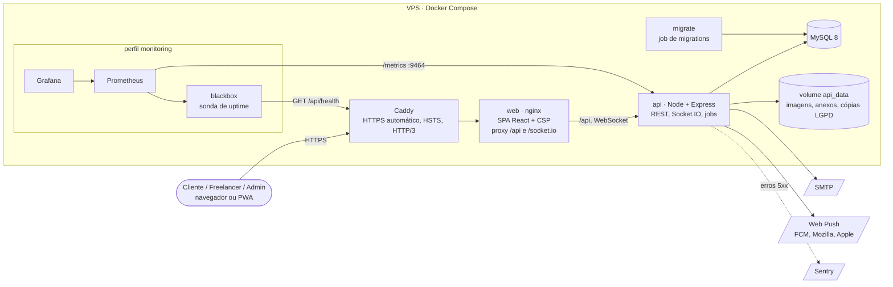

# Arquitetura

O desenho-alvo (C4 níveis 1 a 3) está na seção 5 da [RFC](RFC). Esta página descreve **o que está construído e no
ar**, e onde isso difere do alvo.

## Containers em produção (C4 nível 2, como construído)



| Container                           | Imagem                         | Papel                                                                                         |
| ----------------------------------- | ------------------------------ | --------------------------------------------------------------------------------------------- |
| `caddy`                             | `caddy:2-alpine`               | Única porta aberta (80/443). Certificado Let's Encrypt, HSTS, HTTP/3.                         |
| `web`                               | `ghcr.io/guirenzo/escambo-web` | nginx servindo o build do React, cabeçalhos de segurança (CSP em `'self'`), proxy para a API. |
| `api`                               | `ghcr.io/guirenzo/escambo-api` | Toda a regra de negócio, o chat em tempo real e os jobs em background. Sem porta no host.     |
| `migrate`                           | a mesma da API                 | Aplica baseline + migrations pendentes e sai; a API só sobe depois dele.                      |
| `db`                                | `mysql:8.0`                    | Dados; sem porta no host. Backup diário por `scripts/backup-db.sh`.                           |
| `prometheus`, `blackbox`, `grafana` | oficiais                       | Monitoramento (perfil opcional `monitoring`, ver [Observabilidade](Observabilidade)).         |

**Diferenças do desenho-alvo da RFC** (os ADRs estão em [Decisões de Arquitetura](Decisões-de-Arquitetura)):

- **Pagamentos:** não há gateway real ainda; o depósito PIX é simulado e o webhook já existe (ADR 15).
- **Arquivos:** ficam num volume da própria VPS, não num storage S3 (anexos do chat no ADR 29, imagens de perfil e portfólio no ADR 36).
- **Borda:** Caddy na VPS no lugar do Cloudflare; HTTPS e HSTS resolvidos nele (ADR 20).
- **Processo e deploy:** contêineres com Docker Compose e imagens no GHCR, postas no ar pelo workflow Deploy, no
  lugar de PM2 com `git pull` no servidor (ADR 59).
- **Testes:** Vitest no lugar do Jest (mesma API, e o mesmo runner no back e no front).
- **Monitoramento:** Prometheus, Grafana e sonda blackbox na própria VPS, com um monitor externo recomendado, no
  lugar de depender só do UptimeRobot (ADR 59). Analytics de produto não foi entregue.
- **Login social (OAuth2):** fora do escopo entregue (sem ADR próprio); sessão por JWT com refresh rotativo.
- **Mobile:** o Web é um PWA instalável com avisos push; o app nativo segue como Fase 2 (sem ADR próprio).

## Componentes da API (C4 nível 3)

```
apps/api/src
├── routes.ts            → um router por módulo, montado em /api
├── middlewares/         → autenticação (JWT), papéis, rate limit, manutenção, erros
├── modules/<módulo>/    → <módulo>.routes → .controller → .service → .repository
│   ├── contracts/       → contratação, marcos, prazos, cancelamento (a parte mais densa)
│   ├── wallet/ payments/ withdrawal/ credits/   → dinheiro e créditos (ledgers imutáveis)
│   ├── barter/          → trocas de serviço por serviço
│   ├── messaging/       → chat e anexos
│   ├── notifications/   → avisos no app, e-mail, push e "não perturbe"
│   ├── reports/ disputes/ admin/   → moderação, disputas, painel
│   └── …                → auth, profiles, services, reviews, score, gamification, lgpd, settings
├── jobs/                → aprovação tácita, prazos, lembretes, expirações, resumos, expurgos (scheduler.ts)
└── config/              → env (Zod), banco, logger, socket, métricas, Sentry
```

- **Controller** só traduz HTTP; **service** tem a regra; **repository** tem o SQL. Os três têm teste de unidade
  sem banco (rotas com o service mockado, service com o repository mockado, repository com um banco falso), e o
  conjunto é testado contra o MySQL de verdade nos testes de integração.
- Todo dinheiro se move em **transação** com trava de linha, e cada movimento vira uma linha imutável no ledger.
- Prazos e jobs leem a hora de um **relógio único** (`utils/clock.ts`), e nada automático age de madrugada no
  fuso de quem é afetado (ADR 57). Os lembretes de prazo saem no máximo uma vez por vencimento, por um livro
  (`deadline_reminders`) gravado na mesma transação que confere a contratação e grava o aviso (ADR 58).
- Os tipos que atravessam a rede ficam em `packages/types` e são os mesmos no back e no front.

## Web

`apps/web/src/features/<área>` (telas e componentes de cada área), `components/` (kit de UI próprio),
`lib/` (cliente HTTP com renovação de sessão, socket, datas no fuso). Dados do servidor pelo TanStack Query;
avisos ao vivo pelo Socket.IO invalidam as consultas certas.

## Onde está o resto

- Modelo de dados: [Modelagem do Banco](Modelagem-do-Banco) e `apps/api/db/README.md`.
- Endpoints: `GET /api/docs` (Swagger) e `apps/api/README.md`.
- Por que cada escolha: [Decisões de Arquitetura](Decisões-de-Arquitetura).
