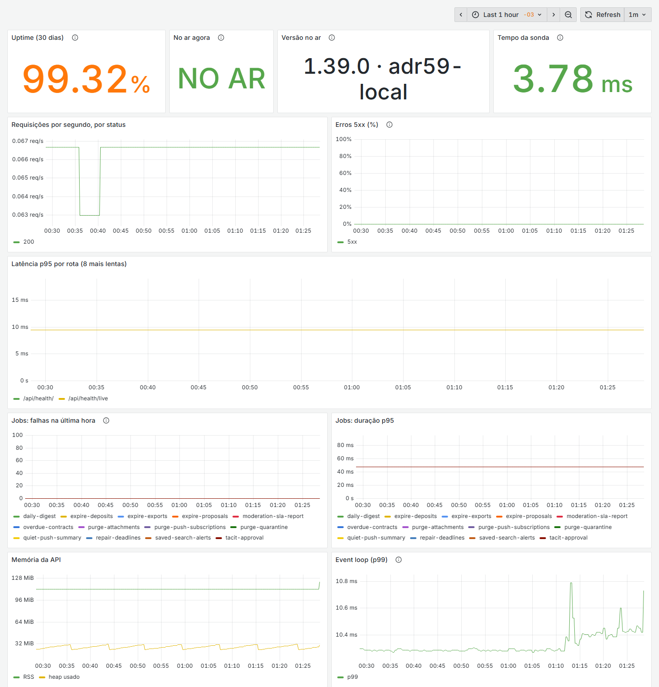

# Observabilidade

Três perguntas, três ferramentas: **está no ar?** (sonda de uptime), **está saudável?** (métricas no
Prometheus + Grafana) e **o que quebrou?** (logs estruturados e erros no Sentry).

## Logs

A API escreve **JSON estruturado** (pino), uma linha por requisição, com o `X-Request-Id` que também volta na
resposta, e uma linha por job. Senhas, tokens e cabeçalhos de sessão são trocados por `[REDACTED]`.

```bash
docker compose -f docker-compose.prod.yml logs -f api
docker compose -f docker-compose.prod.yml logs api | grep '"level":50'      # só erros
```

## Saúde

- `GET /api/health`: a API está de pé **e** fala com o MySQL; devolve a versão e o commit no ar.
- `GET /api/health/live`: o processo responde (não depende do banco).

## Métricas (Prometheus)

A API expõe `/metrics` numa porta própria (**9464**), fora do Express e fora do Caddy: só a rede interna do
compose alcança. Liga com `METRICS_PORT` (o compose de produção já põe 9464).

| Métrica                                   | O que mede                                                                                                    |
| ----------------------------------------- | ------------------------------------------------------------------------------------------------------------- |
| `escambo_http_request_duration_seconds`   | Latência de cada requisição, por método, **rota declarada** (`/api/contracts/:id`, nunca a URL crua) e status |
| `escambo_job_runs_total{job_name,outcome}` | Rodadas de cada job em background, com sucesso ou erro (nasce em zero, para a primeira falha contar)        |
| `escambo_job_duration_seconds{job_name}`  | Quanto cada job levou                                                                                         |
| `escambo_build_info{version,commit}`      | O que está no ar                                                                                              |
| `escambo_process_*`, `escambo_nodejs_*`   | CPU, memória, heap, _event loop lag_, GC                                                                      |
| `probe_success`, `probe_duration_seconds` | A sonda de uptime (blackbox), vista de fora                                                                   |

A requisição que o cliente abandona antes da resposta entra com o status `499` (são as mais lentas, e sem elas o
p95 ficaria cego para a API travada). As métricas dos jobs só existem quando eles rodam dentro da API; no modo
`jobs:run` (cron externo) o processo termina antes de ser lido, e as falhas aparecem só no log e no Sentry.

### Ver na sua máquina (demo)

O mesmo monitoramento sobe com a demo local, com a sonda apontada para o web da demo:

```bash
docker compose --profile monitoring up -d
```

O Grafana abre em <http://localhost:3030>, direto no painel **Escambo**, sem login (só leitura; na demo o
administrador é `admin` com a senha das contas de demonstração).



### Ligar o monitoramento na VPS

O Prometheus, a sonda e o Grafana ficam num perfil opcional do compose. **Ligue depois do primeiro deploy pelo
workflow Deploy:** é ele que copia o `docker-compose.prod.yml` e a pasta `deploy/monitoring/` para a VPS (sem
esses arquivos o compose recusa a subida, com o nome do arquivo que falta). Em instalação à mão, baixe-os antes
(em `/opt/escambo`):

```bash
curl -fsSL https://github.com/Guirenzo/Escambo/archive/refs/heads/main.tar.gz \
  | tar xz --strip-components=1 --wildcards '*/docker-compose.prod.yml' '*/deploy/monitoring/*'
```

Depois, no `.env` da VPS:

```bash
COMPOSE_PROFILES=monitoring
GRAFANA_ADMIN_PASSWORD=<openssl rand -base64 24>
# ALERT_EMAIL_TO=voce@seudominio.com.br   (opcional; o padrão é o ACME_EMAIL)
# PROMETHEUS_RETENTION=45d                (opcional)
```

e `docker compose -f docker-compose.prod.yml up -d`. Os deploys seguintes mantêm os três no ar e, quando um
arquivo de `deploy/monitoring/` muda, reiniciam quem o lê.

O Grafana só escuta no `127.0.0.1` da VPS. Para abrir, faça um túnel da sua máquina e acesse
`http://localhost:3000` (usuário `admin`):

```bash
ssh -L 3000:127.0.0.1:3000 usuario@sua-vps
```

O painel **Escambo** já vem pronto: uptime de 30 dias contra a meta de 99,5% (RNF-007), versão no ar,
requisições por status, taxa de 5xx, latência p95 por rota, falhas e duração dos jobs, memória e event loop.

### Alertas

As regras ficam em `deploy/monitoring/grafana/provisioning/alerting/rules.yml`. O Grafana as avalia a cada minuto
sobre o Prometheus, mostra o estado em **Alerting → Alert rules** e **manda por e-mail** quando uma dispara e
quando volta ao normal:

| Alerta            | Quando                                                                |
| ----------------- | --------------------------------------------------------------------- |
| `SiteForaDoAr`    | a sonda ao `/api/health` falha, ou a própria sonda para, por 3 min    |
| `ApiSemMetricas`  | o Prometheus não alcança a API por 3 min                              |
| `ErrosDoServidor` | mais de 2% das requisições com 5xx por 10 min                         |
| `LatenciaAlta`    | p95 acima de 1 s por 10 min                                           |
| `JobFalhando`     | algum job falhou nos últimos 30 min (o e-mail diz qual)               |

O e-mail sai pelo mesmo SMTP dos avisos do sistema (`SMTP_*` e `MAIL_FROM` do `.env`) para `ALERT_EMAIL_TO`
(padrão: o `ACME_EMAIL`). Sem `SMTP_HOST`, os alertas continuam aparecendo na tela, e só não são enviados. Para
outro canal (Telegram, webhook), acrescente um _contact point_ no Grafana e aponte a política de notificação
para ele.

### Uptime visto de fora da VPS

A sonda roda dentro da própria VPS: se a máquina inteira cair, ela cai junto, e o painel de uptime não conta o
tempo em que não houve sonda. Por isso, cadastre também um monitor externo gratuito (UptimeRobot, Better Stack…) apontando para `https://SEU_DOMINIO/api/health`,
esperando o texto `"db":"up"`.

## Erros (Sentry)

Com `SENTRY_DSN` no `.env`, a API manda ao Sentry as falhas do servidor: os erros que viraram 500, as falhas
de job (também no modo `jobs:run`), as que derrubam o processo e a falha na subida, marcados com a versão e o
commit. Erro do cliente (validação, origem recusada pelo CORS, URL ou corpo malformado) responde 4xx e não vai.
**Nenhum dado pessoal vai junto**: sem usuário, cookies, cabeçalhos, corpos, query string, SQL, variáveis locais
nem o rastro das chamadas anteriores (a URL de um push identifica o aparelho); a mensagem de erro do banco vira só
o código (`ER_DUP_ENTRY`), e qualquer e-mail no texto vira `[email]`. É o mesmo cuidado de LGPD do log. Sem o
DSN, o pacote nem é carregado.

1. Crie um projeto Node.js em [sentry.io](https://sentry.io) (plano gratuito) e copie o DSN.
2. No `.env` da VPS: `SENTRY_DSN=https://…` (e, se quiser, `SENTRY_ENVIRONMENT=producao`).
3. `docker compose -f docker-compose.prod.yml up -d api`.
