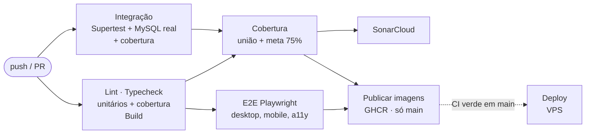

# Qualidade

Tudo roda no GitHub Actions (workflow **CI**) a cada push nos ramos `main`, `feat/`, `fix/`, `chore/` e `docs/` e em todo PR para a `main`. Nada vai para produção sem lint, tipos, testes, cobertura e E2E verdes.

## O pipeline



| Job                             | O que barra                                                                                                                                                           |
| ------------------------------- | --------------------------------------------------------------------------------------------------------------------------------------------------------------------- |
| Lint · Typecheck · Test · Build | `npm audit` sem vulnerabilidade alta, ESLint, `tsc` nos três pacotes, testes de unidade da API (piso de 90%) e de componente do Web (piso de 90%), build, compose de produção válido |
| Integração                      | App Express real contra MySQL 8 (banco `escambo_test` recriado a cada rodada)                                                                                         |
| E2E                             | Fluxos inteiros no navegador (Chromium desktop e mobile), acessibilidade com axe                                                                                      |
| Cobertura                       | Meta de **75%** no backend também sobre a união unitários + integração                                                                                                |
| SonarCloud                      | Não barra: registra bugs, vulnerabilidades, _security hotspots_, duplicação e a cobertura do backend no painel do projeto e no PR                                     |
| Publicar imagens                | Só em `main`, com os testes, o E2E e a cobertura verdes                                                                                                               |

## Cobertura

Meta do Playbook para Web Apps: **75% no backend e 25% no frontend**. Todo arquivo de `src` entra na conta,
tenha teste ou não.

- **Backend, testes de unidade (a meta do Playbook):** **99,1%** das linhas, sem banco. Os _services_
  (regra de negócio) são testados com os _repositories_ mockados; as rotas e os controllers, com o router de
  cada módulo, o `authenticate` e o tratamento de erros de verdade e o _service_ mockado (quem pode chamar, o que
  a validação recusa, o que chega ao _service_); os _repositories_, com um banco falso que guarda cada instrução
  e os parâmetros (o que cada método pede, o que faz com o resultado, commit e rollback). A meta do Playbook é
  75%; o Vitest barra a rodada abaixo de 90% das linhas (`apps/api/vitest.config.ts`), para a cobertura que
  existe não se desfazer aos poucos.
- **Backend, integração:** o app inteiro contra o MySQL de verdade, que é onde se prova que o SQL roda. Unida
  aos unitários (`scripts/coverage-merge.mjs`), a cobertura é de **99,3%**, e o job "Cobertura" confere os 75%
  também sobre a união. O resumo de cada rodada mostra os três números: só unitários, só integração e a união.
- **Frontend:** **99,5%** das linhas, em testes de componente (Testing Library) e das bibliotecas: o que a
  pessoa vê e faz, o que vai para a API e o erro que aparece. A meta do Playbook é 25%; o Vitest barra a rodada
  abaixo de 90% (`apps/web/vite.config.ts`).

Na máquina:

```bash
npm run -w @escambo/api test:cov        # unitários da API (piso 90%) → apps/api/coverage/unit
npm run db:up                            # MySQL para a integração
npm run -w @escambo/api test:int:cov    # integração        → apps/api/coverage/integration
npm run coverage:merge                   # união + meta      → apps/api/coverage/merged
npm run -w @escambo/web test:cov        # web (piso 90%)    → apps/web/coverage
```

## Análise estática (SonarCloud)

O job `sonar` do CI manda o código e a cobertura do backend ao SonarCloud. Ele liga sozinho quando o segredo
existe; sem o segredo, o job termina verde com um aviso. É **informativo**: uma falha do scan (serviço fora, chave
errada) não segura imagem nem deploy, e o Quality Gate fica no painel do projeto e no PR.

A cobertura que o SonarCloud mostra é a do **backend** (unitários + integração), que é a meta de 75%. O frontend e
os tipos são analisados, mas ficam fora desse número (`sonar.coverage.exclusions`): o SonarCloud mostra uma
cobertura só por projeto, e somar as duas aplicações daria uma média que não é a meta de nenhuma. A do frontend é a
do job de testes.

Para ligar (uma vez):

1. Entre em [sonarcloud.io](https://sonarcloud.io) com a conta do GitHub e importe a organização `guirenzo`
   e o projeto `Guirenzo/Escambo`.
2. Em **Administration → Analysis Method**, desligue a _Automatic Analysis_ (a análise vem do CI, com cobertura).
3. Confira em `sonar-project.properties` se `sonar.organization` e `sonar.projectKey` são os que o SonarCloud
   mostrou (em **Administration → Update key**); se forem outros, corrija o arquivo antes do próximo passo.
4. Em **My Account → Security**, gere um token.
5. No GitHub: **Settings → Secrets and variables → Actions → New repository secret**, nome `SONAR_TOKEN`.

O próximo push roda a análise; o selo e o Quality Gate ficam na página do projeto no SonarCloud.

Depois que o deploy, o SonarCloud e a Wiki estiverem ligados, crie a variável de repositório
`DELIVERY_ENFORCED=true` (**Settings → Secrets and variables → Actions → Variables**): a falta de um segredo
deixa de ser aviso e passa a ser erro, para o verde não esconder uma entrega desligada.

## Outras garantias

- **Tipos compartilhados** (`packages/types`): mudar um contrato de API quebra o `tsc` do lado que não acompanhou.
- **Relógio único** nos prazos, com um teste que proíbe `NOW()` do MySQL nesses arquivos (ADR 57).
- **Migrations** só aditivas, aplicadas pelo mesmo runner no CI (E2E) e em produção, com ledger e checksum.
- **Dependências:** `npm audit --audit-level=high` roda no CI e barra vulnerabilidade alta; o Dependabot abre,
  toda semana, os PRs de atualização do npm e das actions (`.github/dependabot.yml`).
- **Revisão por pares:** o fluxo é Pull Request com revisão e bugs em Issues, com os modelos em `.github/`
  (ver [Como Contribuir](Como-Contribuir)). Até a 1.39.0 a maior parte das mudanças entrou por merge local de
  ramos `feat/`, com o CI rodando no ramo; a partir da 1.40.0 cada bloco sobe por PR.
